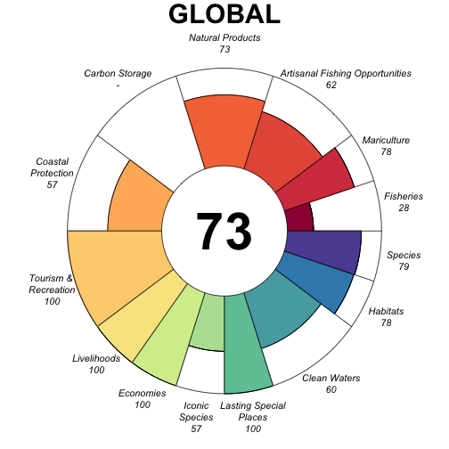
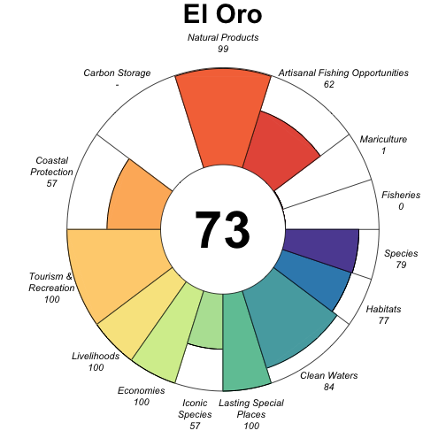
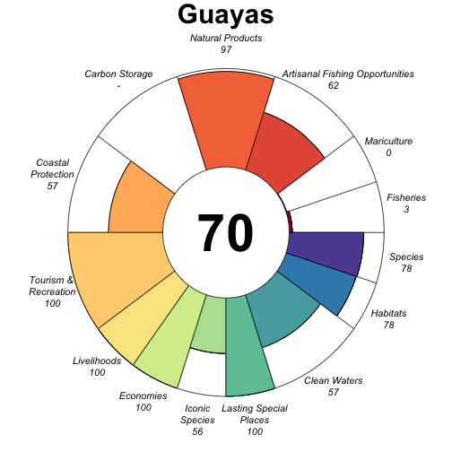
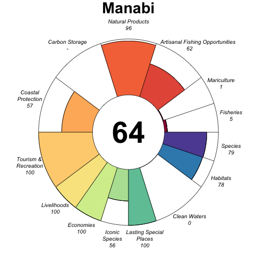

# Ocean Health Index Report


```
## Warning: package 'knitr' was built under R version 3.1.1
```


## GLOBAL (0)


### Flower




### Scores


## El Oro (1)


### Flower




### Scores


## Esmeraldas (5)


### Flower


### Scores


## Galápagos (4)


### Flower


### Scores


## Guayas (2)


### Flower




### Scores


## Manabi (3)


### Flower




### Scores
